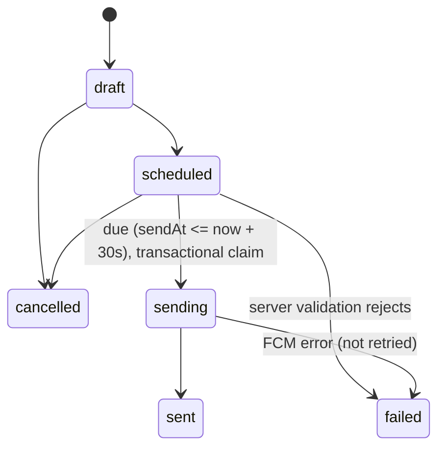

# Kharis API reference

Every remote surface the Flutter app (`app/`) and the Content Studio (`admin/index.html` plus the in-app Studio under `app/lib/features/admin`) read from or write to.

Related documents:

- [`openapi.yaml`](openapi.yaml) is the OpenAPI 3.1 description of the HTTP endpoints in sections 1 to 3.
- [`MOBILE-INTEGRATION.md`](MOBILE-INTEGRATION.md) maps each app repository and provider to the endpoints and collections below, and covers timeouts, fallbacks, caching and testing.

Terminology: a church location is a **Branch**. Stored data keeps its original names. That includes the `branch` field, `adminBranchIds`, `adminBranchNames`, the role id `campus_admin` (shown to people as "Branch admin"), FCM topic ids, and code identifiers such as `CampusVenue`.

Where examples come from:

- **Live**: captured with read-only `curl` against production on 2026-10-05. Long arrays are trimmed and marked `…`.
- **Code**: built from the source file named next to the example.

Contents

1. [Cloud Functions (HTTP)](#1-cloud-functions-http)
2. [Public sermon API (yetanothersermon.host)](#2-public-sermon-api-yetanothersermonhost)
3. [Media engine: Cloudflare import Worker and R2 bucket](#3-media-engine-cloudflare-import-worker-and-r2-bucket)
4. [YouTube Data API](#4-youtube-data-api)
5. [Cloud Functions (schedulers and Firestore triggers)](#5-cloud-functions-schedulers-and-firestore-triggers)
6. [Firestore collections](#6-firestore-collections)
7. [Push notifications](#7-push-notifications)
8. [Ops: R2 bucket CORS](#8-ops-r2-bucket-cors)
9. [Function inventory](#9-function-inventory)

---

## 1. Cloud Functions (HTTP)

Firebase project `kharis-app-47c49`. The source is in `backend/functions/src`, and every function is exported from `index.ts`.

The base URL comes from `app/lib/core/constants/api_config.dart` (`ApiConfig`):

```
https://us-central1-kharis-app-47c49.cloudfunctions.net
```

One exception: `feedProxy` is deployed in `europe-west1` (`https://europe-west1-kharis-app-47c49.cloudfunctions.net/feedProxy`).

Behaviour shared by the read endpoints (`getAnnouncements`, `getBranches`, `getEvents`, `getDailyReading`):

- `GET` only. Any other method returns `405 {"error":"Method Not Allowed"}`.
- No authentication.
- CORS is open (`cors: true`), so the response echoes the request origin and carries `vary: Origin`.
- Timestamps are ISO 8601 UTC strings, except in `getBranches`, which returns document fields verbatim (see below).
- Each response also includes `count`, the length of the returned array.
- Unhandled errors (for example, Firestore unavailable) surface as the platform's default `500`. These functions define no JSON error body for that case.

### 1.1 GET /getAnnouncements

Returns live announcements from the `news` collection, newest first. An announcement is live when `publishedAt <= now` and it either has no `expiresAt` or `expiresAt > now`. Source: `index.ts`, `announcements.ts`.

| Query param | Type | Default | Notes |
|---|---|---|---|
| `branch` | string (Branch **name**, e.g. `London`) | none | When set, returns that Branch's announcements **plus** church-wide ones (`branch` null, blank or absent). Branch-scoped items are picked first and the page is then re-sorted by date. Without it, returns every Branch's announcements. |
| `limit` | int | 20 | Capped at 50. |

Caching: no `Cache-Control` header is set. Clients poll it, and push taps trigger a refetch.

Response (`AnnouncementJson`, code: `announcements.ts`):

```json
{
  "announcements": [
    {
      "id": "Xa12…",
      "title": "Baptism Sunday",
      "body": "Speak to the welcome team after the service.",
      "type": "Announcement",
      "branch": "London",
      "imageUrl": null,
      "publishedAt": "2026-10-04T08:00:00.000Z",
      "expiresAt": null,
      "eventId": null,
      "linkUrl": "https://kharis.org/baptism",
      "ctaLabel": "Learn more"
    }
  ],
  "count": 1,
  "timestamp": "2026-10-05T22:02:47.278Z"
}
```

Field notes:

- `type` is never `Event`. Legacy docs typed `Event` are served as `Announcement`.
- `ctaLabel` defaults to `Learn more` when `linkUrl` is set, and is `null` when there is no link.
- `expiresAt: null` means the announcement never expires.

Live response on 2026-10-05 (nothing was live at the time): `{"announcements":[],"count":0,"timestamp":"2026-10-05T22:02:47.278Z"}`.

### 1.2 GET /getBranches

Returns every `branches` document ordered by `order` ascending. The document fields are returned verbatim, with the doc id added as `id`.

- No query params.
- Caching: `Cache-Control: public, max-age=300`.

Firestore `Timestamp` fields such as `updatedAt` and `createdAt` come back in the Admin SDK's JSON form, `{"_seconds": n, "_nanoseconds": n}`. They are not ISO strings. Clients ignore these fields.

Live example (one Branch fully shown, the rest trimmed):

```json
{
  "branches": [
    {
      "id": "london-hq",
      "group": "Kharis",
      "name": "London",
      "subtitle": "United Kingdom · Main Campus",
      "order": 0,
      "isActive": true,
      "meetingDays": "Sundays",
      "meetingTime": "10:00 AM",
      "address": "Kensington Town Hall, Hornton St, London W8 7NX, United Kingdom",
      "imageUrl": "assets/design/city-london-hq.jpg",
      "gradientStart": "#3B2A6B",
      "gradientEnd": "#7C3AED",
      "branding": { "gradientStart": "#3B2A6B", "gradientEnd": "#7C3AED" },
      "instagram": "",
      "contact": { "email": "", "phone": "" },
      "description": "test ",
      "shortDescription": "test",
      "hero": { "subtitle": "Test", "imageUrl": "assets/design/city-london-hq.jpg" },
      "featuredVideo": { "title": "Photo", "youtubeUrl": "https://www.youtube.com/watch?v=El1RpnRYA30", "thumbnailUrl": "" },
      "venues": [
        {
          "id": "main", "name": "London Venue",
          "addressLine1": "Kensington Town Hall, Hornton St, London W8 7NX", "addressLine2": "",
          "city": "", "postcode": "", "country": "United Kingdom",
          "latitude": null, "longitude": null,
          "parkingInfo": "teset oark", "publicTransportInfo": "bus", "directionsText": "ask"
        }
      ],
      "services": [
        {
          "id": "main-service", "name": "Sunday Service", "type": "sunday", "day": "Sundays",
          "startTime": "10:00 AM", "endTime": "12:00", "venueId": "main",
          "description": "", "order": 1, "isActive": true
        }
      ],
      "pastor": { "name": "Rev Dr David Antwi", "imageUrl": "", "bio": "the best pastor ever" },
      "galleryImages": [ { "imageUrl": "", "alt": "", "order": 1 } ],
      "updatedAt": { "_seconds": 1788190536, "_nanoseconds": 248000000 }
    },
    { "id": "birmingham", "group": "Kharis", "name": "Birmingham", "order": 1, "subtitle": "…", "imageUrl": "…", "gradientStart": "…", "gradientEnd": "…" }
  ],
  "count": 24
}
```

The live data is test data entered in the Studio and is reproduced as-is.

Branch docs vary: older Branches carry only the identity fields. See [6.2](#62-branches) for the full shape.

### 1.3 GET /getEvents

Returns events from the `events` collection. Source: `index.ts`, `events-api.ts`.

| Query param | Type | Default | Notes |
|---|---|---|---|
| `branch` | string (Branch name) | none | That Branch's events plus church-wide events (`branch` null, blank or absent). Without it, returns every Branch's events. |
| `when` | `upcoming` \| `past` | `upcoming` | `upcoming`: not yet finished, soonest first. `past`: finished, most recent first. |
| `limit` | int | 50 (upcoming), 15 (past) | Capped at the default: 50 for upcoming, 15 for past. The past view is never more than the 15 most recent events. |

Rules:

- An event's effective end is `endTime`, or `startTime` when there is no end.
- Upcoming means the effective end is at or after now. The query reaches back 2 days (`IN_PROGRESS_LOOKBACK_MS`), so an event that is running stays listed.
- Docs with `hidden: true` are never returned. These are tombstones of deleted website events.

Caching: `Cache-Control: public, max-age=300` for upcoming and `public, max-age=60` for past.

Response (`EventJson`), live, `?when=past&limit=1`:

```json
{
  "events": [
    {
      "id": "aug-2026-kp2-revival",
      "title": "KP2 Youth Revival",
      "description": "Kharis Phase Two - a revival night for young people.",
      "location": "Kensington Town Hall, London",
      "branch": null,
      "imageUrl": null,
      "isFeatured": true,
      "startTime": "2026-08-29T16:00:00.000Z",
      "endTime": "2026-08-29T19:00:00.000Z"
    }
  ],
  "count": 1
}
```

`EventJson` also has `address` (string or null). The deployed function predates that field, and live responses omit it until the next deploy.

### 1.4 GET /getDailyReading

Resolves the Bible reading for a date. Resolution order (`reading-plans.ts`):

1. `dailyContent/{YYYY-MM-DD}`, a reading written by hand for that date. It always wins.
2. The covering `readingPlans` doc. When several plans cover the date, the most recently started plan wins.
3. If no plan covers the date, the plan that ended most recently is pinned to its last day.

| Query param | Type | Default | Notes |
|---|---|---|---|
| `date` | `YYYY-MM-DD` | today in Europe/London | |
| `month` | `YYYY-MM` | none | Returns every resolvable reading in that month, date ascending. Takes precedence over `date`. |

- Caching: `Cache-Control: public, max-age=300`.
- Errors: `400 {"error":"date must be YYYY-MM-DD"}` or `400 {"error":"month must be YYYY-MM"}` (live).

Live response:

```json
{
  "readings": [
    {
      "date": "2026-10-05",
      "reading": { "book": "2 Corinthians", "chapter": 19, "verse": "1-end" },
      "prayer": "Lord, speak to us through 2 Corinthians 19 today.",
      "prayerReference": "2 Corinthians 19",
      "source": "plan",
      "planId": "MlCzng0YB8ZqbIvLzVK4",
      "planTitle": "September - part 2"
    }
  ],
  "count": 1
}
```

Field notes:

- `source` is one of `day`, `plan` or `plan-last-day`. `planId` and `planTitle` are `null` for `day`.
- The current source also returns `planDay` and `planDays` (for example "Day 3 of 13"; both `null` for a `day` reading). The deployed build predates these fields.
- The chapter shown in the live response is what production currently resolves for this plan.

### 1.5 GET /searchYouTube (admin only)

The Content Studio's channel browser (`admin/index.html`, `YT_SEARCH_URL`) uses this endpoint. It runs a live search over all uploads on the Kharis Church channel (`UC4l8WmdF9ivMDQHHVOdYKqQ`). Source: `sync-youtube.ts`.

Auth:

- Send `Authorization: Bearer <Firebase ID token>`.
- The caller must have `users/{uid}.role == 'admin'` or the custom claim `admin: true`.
- Branch admins (`campus_admin`) get `403`.
- Every call spends YouTube quota (see [section 4](#4-youtube-data-api)).

| Query param | Type | Default | Notes |
|---|---|---|---|
| `q` | string | empty | Empty: newest uploads (`order=date`). Non-empty: `order=relevance`. |
| `pageToken` | string | none | The `nextPageToken` from the previous page. |
| `limit` | int | 25 | Capped at 50. |

Caching: `Cache-Control: private, no-store`.

Response (code: `sync-youtube.ts`):

```json
{
  "videos": [
    {
      "videoId": "VdGcMD4Rwy8",
      "title": "Christ: The Eternally Blessed God",
      "description": "…",
      "thumbnailUrl": "https://i.ytimg.com/vi/VdGcMD4Rwy8/hqdefault.jpg",
      "publishedAt": "2026-09-27T12:00:00Z",
      "duration": 2945,
      "inLibrary": true,
      "isFeatured": false
    }
  ],
  "nextPageToken": "CBkQAA",
  "totalResults": 812,
  "count": 1
}
```

Field notes:

- `duration` is in seconds, and is 0 when the details lookup fails.
- `inLibrary` means `sermons/yt_<videoId>` exists.
- `isFeatured` mirrors that doc's `isFeatured`.

Errors:

| Status | Body | Cause |
|---|---|---|
| 401 | `{"error":"Sign-in required"}` | Missing or invalid token (live) |
| 403 | `{"error":"Admin only"}` | Signed in but not a super admin |
| 405 | `{"error":"Method Not Allowed"}` | Method other than GET |
| 500 | `{"error":"YOUTUBE_API_KEY not configured"}` | Server key missing |
| 502 | `{"error":"YouTube API error <status>"}` | Upstream YouTube error |

### 1.6 GET /sermonApiProxy/{resource}/

A CORS proxy that lets web builds reach the public sermon API ([section 2](#2-public-sermon-api-yetanothersermonhost)). Source: `sermon-proxy.ts`. Native builds call the upstream directly.

`ApiConfig.sermonApiBase` picks the base URL: `kIsWeb ? sermonApiProxyBase : sermonApiDirectBase`.

- Paths: only `sermons/`, `series/` and `playlists/` are forwarded, plus their sub-resources such as `sermons/123/`. Paths must end with `/`. Anything else returns `404 {"error":"Only sermons/, series/ and playlists/ are proxied"}`.
- Methods: GET only (`405` otherwise).
- Query string: forwarded verbatim (`page`, `search`).
- Upstream request: sent with a desktop Chrome `User-Agent`.
- Links: absolute upstream URLs in the body (`next`, `previous`) are rewritten to the proxy base, so following `next` stays on the proxy.
- CORS: limited to an allow-list of origins:
  - `https://kharis-app-47c49.web.app` and `.firebaseapp.com`
  - `https://kharis-app-admin.web.app` and `.firebaseapp.com`
  - `http://localhost:*` and `http://127.0.0.1:*`

  The `kharis-church-admin` hosting site (`admin/firebase.kharis-church.json`) is **not** on this list.
- Caching: `Cache-Control: public, max-age=300` on upstream 2xx responses. Upstream errors are passed through with `no-store`.
- Errors: when the upstream fetch throws, the proxy returns `502 {"error":"Upstream fetch failed: <message>"}`.
- The response body has the same shape as [2.1](#21-get-sermons).

Deployment status on 2026-10-05: `GET /sermonApiProxy/sermons/?page=2` returned Google's HTML `404 Page not found`, which means the function is not deployed yet. Until it is, web builds cannot reach the sermon API, and the Messages tab on web shows the bundled archive.

### 1.7 GET /feedProxy

A CORS-safe pass-through for the church's RSS/Atom feeds. Source: `feed-proxy.ts`.

- Region: `europe-west1`. URL: `https://europe-west1-kharis-app-47c49.cloudfunctions.net/feedProxy`.
- Query param `source`:
  - `youtube` returns the channel Atom feed.
  - Anything else, including no value, returns the SoundCloud RSS feed (`soundcloud:users:58625221`).
- Response: upstream XML as-is. Live `?source=youtube` returned `content-type: text/xml; charset=utf-8`.
- Caching: `Cache-Control: public, max-age=60, s-maxage=300`.
- Errors: an upstream non-2xx status is passed through with the upstream body. A fetch failure returns `502` with the text `Upstream fetch failed: …`.
- No method check.

The current app does not call `feedProxy`: `VideoRepository` fetches the YouTube Atom feed directly. The function is kept for web use.

---

## 2. Public sermon API (yetanothersermon.host)

The church's sermon host. It is read-only, needs no auth, and is not run by Kharis.

```
https://yetanothersermon.host/_/kc/public-api/v1/
```

Used by:

- `app/lib/features/messages/data/kharis_api_sermon_repository.dart`, directly on mobile and through `sermonApiProxy` on web.
- The Cloudflare import Worker ([section 3](#3-media-engine-cloudflare-import-worker-and-r2-bucket)).

Requirements and quirks:

- **User-Agent.** The host sits behind Cloudflare bot protection. `http_constants.dart` documents that non-browser agents (Dio's default) get `403`, so native clients send `kBrowserUserAgent` (an iPhone Safari UA) on every API and audio request. In a live check on 2026-10-05, the API also answered `200` to curl's agent and to `Dart/3.5 (dart:io)`. Keep sending the browser UA anyway, because the protection level can change.
- **No CORS.** The live response carries no `Access-Control-*` headers even when an `Origin` is sent. Browsers must use `sermonApiProxy`.
- **Scheme-less URLs.** `audio_link.download_url` and `preachers[].url` have no scheme, for example `yetanothersermon.host/_/kc/media/mp3/99934.mp3`. Clients prepend `https://`. `next` links do carry a scheme.
- **Audio redirect.** `GET https://yetanothersermon.host/_/kc/media/mp3/<id>.mp3` answers `302`. The `Location` is a time-limited signed Cloudflare R2 URL with `X-Amz-Expires=5400`, which is 90 minutes. Players must follow redirects with the same UA, and must not cache the signed URL beyond its expiry.
- **Ignored filters.** `series` and `preacher` query filters are ignored server-side. The app filters by series and topic on the client.

### 2.1 GET sermons/

| Query param | Notes |
|---|---|
| `page` | 1-based. The page size is fixed at 50. |
| `search` | Full-text search. `next` carries it forward, e.g. `?page=2&search=grace`. |

Pagination follows the Django REST style. Walk `next` until it is `null`. `count` is the total.

Live response (first record of 50 shown):

```json
{
  "count": 1489,
  "next": "https://yetanothersermon.host/_/kc/public-api/v1/sermons/?page=2",
  "previous": null,
  "results": [
    {
      "id": 101897,
      "title": "Christ: The Eternally Blessed God",
      "time": null,
      "date": "2026-09-27",
      "passages": ["1 Timothy 3:16"],
      "series": null,
      "preachers": [
        { "id": 1880, "name": "David Antwi", "url": "yetanothersermon.host/_/kc/preachers/1880/david-antwi/", "bio": null, "image_id": null }
      ],
      "audio_link": {
        "id": 99934,
        "duration": 2945,
        "filesize": 47138066,
        "download_url": "yetanothersermon.host/_/kc/media/mp3/99934.mp3",
        "name": "e7574957-…_71dvhpb.mp3",
        "mp3_etag": null
      },
      "video_link": "https://www.youtube.com/watch?v=VdGcMD4Rwy8&t=487s",
      "image": "https://yash.b-cdn.net/media/images/Kharis_resized_H6Mr63b.jpeg?width=256",
      "image_id": null,
      "podcast_artwork_id": null,
      "description": "Christianity is often shrouded in mysticism, …",
      "transcription_id": 96162,
      "attachments": [],
      "tags": ["David Antwi", "Kharis Church", "PDAK"],
      "meeting_type": "Sunday Morning",
      "bible_version": null
    }
  ]
}
```

A search on 2026-10-05, `?search=grace`, returned `count: 55` with `next: …/sermons/?page=2&search=grace`.

How the app maps a record (`mapApiSermon`):

| Sermon field | Source |
|---|---|
| `id` | `id` as a string |
| `speaker` | `preachers[].name` joined with `, ` |
| `audioUrl` | `https://` + `audio_link.download_url` |
| `duration` | `audio_link.duration` (seconds) |
| `publishedAt` | `date` (+ `time`) |
| `artworkUrl` | `image`, with `?width=256` bumped to `512` |
| `videoId` / `videoStart` | parsed from `video_link` (`watch?v=`, `youtu.be`, `/live/`, `/shorts/`, `t=`) |
| `category` | derived from title and description, client-side |

### 2.2 GET series/ and GET playlists/

Both use the same `count/next/previous/results` envelope.

- `series` records carry `id` and `name` (or `title`).
- The playlist record shape is not confirmed. The Worker accepts `sermons` or `items`.

The app does not call either endpoint directly. They feed the Worker.

---

## 3. Media engine: Cloudflare import Worker and R2 bucket

Jonathan's media engine. The source is in `backend/cloudflare-worker/`; `src/index.js` is the only worker. It mirrors the sermon API into a public R2 bucket and adds the data that only exists on the sermon web pages: tags, related messages and transcripts.

### 3.1 Import Worker

| | |
|---|---|
| Worker name | `kharis-import-worker` (`wrangler.toml`) |
| Schedule | cron `0 6 * * 1,4`: Monday and Thursday, 06:00 UTC |
| R2 binding | `MESSAGES_BUCKET` → bucket `kharis-messages` |
| Vars | `SCRAPE_CONCURRENCY` (default `6`) |
| Secret | `MANUAL_TRIGGER_SECRET` |
| Manual run | `GET https://kharis-import-worker.<subdomain>.workers.dev/run-import?secret=<secret>`. Returns `401 Unauthorized` without the secret, `404` on any other path, a JSON summary `{messagesCount, playlistsCount, scrapedThisRun, reusedFromCache, log[]}` on success, and `500 Import failed: …` on failure. |

What one run does:

1. Walks `series/`, `sermons/` and `playlists/` on the sermon API, following `next` until `null`. A failure on series or playlists is logged and skipped. A failure on sermons aborts the run.
2. Maps each sermon to the flat `messages.json` schema ([3.2](#32-messagesjson)). Scheme-less audio URLs become `https://…`.
3. Computes `previous_id` and `next_id` within each series, ordered oldest first by `date_preached`. Sermons with no series form one group. Two sermons in the same series with the same date are logged as ambiguous.
4. For each sermon not already in `_cache/detail-cache.json`, fetches `https://yetanothersermon.host/_/kc/sermons/<id>/` and scrapes:
   - the Tags block
   - the Related Messages ids
   - the transcript `.txt` link, whose transcript id differs from the sermon id
   It then writes the transcript text, starting at the first `[m:ss]` timestamp, to `transcripts/<sermonId>.txt`.
5. Writes `_cache/detail-cache.json`, `messages.json` and `playlists.json`. Both JSON catalogue files are written with `Cache-Control: public, max-age=300`.

### 3.2 messages.json

Public URL (`kR2MessagesUrl` in `app/lib/core/constants/http_constants.dart`):

```
https://pub-1cfba9da59dd4e03b1f867b35e26a1a4.r2.dev/messages.json
```

Live headers on 2026-10-05:

- `200`, `Content-Type: application/json`, `Content-Length: 1487658` (about 1.5 MB)
- `Cache-Control: public, max-age=300`, with `ETag` and `Last-Modified: Sun, 04 Oct 2026 06:01:53 GMT`
- **No `Access-Control-Allow-Origin` header**, even with an `Origin` request header. See [section 8](#8-ops-r2-bucket-cors).

The file held 1,489 messages, matching the API count. Live record:

```json
{
  "messages": [
    {
      "id": "101897",
      "external_id": "101897",
      "title": "Christ: The Eternally Blessed God",
      "speaker": "David Antwi",
      "date_preached": "2026-09-27",
      "series": null,
      "topics": [],
      "keywords": [],
      "scripture_refs": ["1 Timothy 3:16"],
      "audio_url": "https://yetanothersermon.host/_/kc/media/mp3/99934.mp3",
      "image_url": "https://yash.b-cdn.net/media/images/Kharis_resized_H6Mr63b.jpeg?width=256",
      "duration": 2945,
      "description": "Christianity is often shrouded in mysticism, …",
      "transcript_available": true,
      "video_url": "https://www.youtube.com/watch?v=VdGcMD4Rwy8&t=487s",
      "tags": ["PDAK", "Kharis Church", "David Antwi"],
      "related_message_ids": ["100220", "100239", "100513", "101138", "101139"],
      "transcript_url": "transcripts/101897.txt",
      "previous_id": "101139",
      "next_id": null
    }
  ]
}
```

Schema (from `mapSermon` in `src/index.js`):

| Field | Type | Notes |
|---|---|---|
| `id`, `external_id` | string | The sermon API id |
| `title`, `speaker` | string \| null | `speaker` is the first preacher |
| `date_preached` | `YYYY-MM-DD` \| null | |
| `series` | `{id: string, name: string\|null}` \| null | |
| `topics`, `keywords` | string[] | Always empty today |
| `scripture_refs` | string[] | The API's `passages` |
| `audio_url` | string \| null | Absolute. It 302-redirects like the API URL does. |
| `image_url` | string \| null | |
| `duration` | int \| null | Seconds |
| `description` | string \| null | |
| `video_url` | string \| null | YouTube link, may carry `t=` |
| `tags` | string[] | Scraped |
| `related_message_ids` | string[] | Scraped. Excludes the sermon's own id. |
| `transcript_available` | bool | |
| `transcript_url` | string \| null | **Relative to the bucket**, e.g. `transcripts/101897.txt` |
| `previous_id`, `next_id` | string \| null | Order within the series |

### 3.3 transcripts/{id}.txt and playlists.json

`transcripts/<sermonId>.txt`:

- Served as `text/plain; charset=utf-8`, with no CORS headers.
- The text is machine-generated, with `[m:ss]` timestamps.
- Live sample: `[0:00] Welcome and thank you for joining this message by …`.

`playlists.json` has the shape `{"playlists": [{"id": "6", "title": "Catch The Glory Messages", "message_ids": []}, …]}` (live). The `message_ids` lists are currently empty. The app does not read this file.

`_cache/detail-cache.json` is the Worker's private scrape cache. It is publicly readable on the bucket, but it is not an API.

### 3.4 How the app merges R2 with the API

`R2MessagesRepository` (`app/lib/features/messages/data/r2_messages_repository.dart`) is the app's sermon repository (`sermonRepositoryProvider`).

Page 1 (no `url`, no `search`):

1. Starts the API page-1 request (`KharisApiSermonRepository.fetchPage()`) and the `messages.json` download in parallel.
2. Mirror download limits:
   - Dio `connectTimeout` 10 s
   - per-request `receiveTimeout` 20 s
   - an overall `mirrorDeadline` of **25 s** on the whole download and parse
3. When the mirror arrives with at least one record, the result is:
   - the API's page-1 records first, each given R2's `transcriptUrl` when R2 has one
   - then every mirror record not already listed
   This is returned as a single page with `nextUrl = null` and `totalCount` set to the merged length.
4. When the mirror fails, times out, is empty or is malformed, page 1 falls back to the sermon API. The app awaits the API head request (or retries it) and continues the normal paged walk through `next`. On web this is always the path today, because the bucket sends no CORS headers. **Web builds therefore show no transcripts.**

Searches and `next` links always go to the API. With no network at all, `loadCatalogue()` serves the bundled archive `app/assets/data/kharis_sermons.json`.

Transcript URLs are resolved against `kR2BucketBaseUrl`, giving `https://pub-…r2.dev/transcripts/<id>.txt`.

---

## 4. YouTube Data API

Two callers. Both use YouTube Data API v3 at `https://www.googleapis.com/youtube/v3` and the channel `UC4l8WmdF9ivMDQHHVOdYKqQ`.

| Caller | Calls | Key | Quota per run |
|---|---|---|---|
| `syncYouTube` (scheduler, `sync-youtube.ts`) | `search?part=id,snippet&channelId=…&order=date&type=video&maxResults=50`, then `videos?part=contentDetails&id=…` | Functions param `YOUTUBE_API_KEY` (`defineString`) | 100 (search) + 1 (videos) = **101 units per hour**, about 2,424 per day |
| `searchYouTube` (HTTP, admin) | the same `search` with `q` / `pageToken`, then `videos` | same | **101 units per call** |
| App `VideoRepository` (`video_repository.dart`) | `playlistItems?part=snippet,contentDetails&playlistId=UU4l8WmdF9ivMDQHHVOdYKqQ&maxResults=20`, then `videos?part=contentDetails` | build-time `YOUTUBE_API_KEY` from `env.json` | 2 units per load, per device |

The quota figures use the standard costs: `search.list` is 100 units, and `playlistItems.list` and `videos.list` are 1 unit each. The default project quota is 10,000 units per day.

The hourly sync uses about a quarter of that. Each Studio search uses about 1%, so roughly 75 searches per day fit alongside the sync. `searchYouTube` is gated to super admins for this reason.

`syncYouTube` writes `sermons/yt_<videoId>` with `{merge: true}`:

- Fields: title, `speaker: "David Antwi"`, description, videoId, thumbnailUrl, duration, publishedAt, `source: "youtube"`, `type: "video"`, `playCount: 0`, createdAt, updatedAt.
- Empty values are dropped before the write.
- Because it merges, an admin's `isFeatured` survives the sync.

The app's video fallbacks are, in order:

1. the Data API
2. the public Atom feed `https://www.youtube.com/feeds/videos.xml?channel_id=…`, fetched directly, which on web usually fails CORS
3. the embedded list `kharisVideos` in `kharis_content.dart`

The app drops videos shorter than 120 s and titles that look like Shorts or music clips.

---

## 5. Cloud Functions (schedulers and Firestore triggers)

All functions run in `us-central1` (the default region) unless noted. Times are Europe/London unless noted.

| Function | Trigger | What it does | Audience / topic | Idempotency |
|---|---|---|---|---|
| `pushPendingAnnouncements` | every 1 minute | Pushes `news` docs that became live within the last 15 minutes and have not been pushed yet. A future `publishedAt` is pushed when it arrives. Body is capped at 140 chars. Data: `{type:'announcement', newsId, branch, eventId?}` | `branchTopic(news.branch)`: `branch_<slug>` or `all` | Writes `pushedAt`, `pushTopic` and `pushMessageId` onto the news doc, and `pushError` on failure. The 15-minute window stops it from sending the backlog. |
| `pushDailyReading` | cron `0 7 * * *` (07:00) | Pushes "Today's Bible reading" with the resolved reference. Data: `{type:'reading', date, reference, source}` | topic `daily_reading` | Claims `dailyReadingPushes/{date}` in a transaction before sending. A failed send records `pushError` and is not retried. |
| `pushBirthdays` | cron `0 8 * * *` (08:00) | Direct push to each user whose `dob` month-day is today and who has an `fcmToken`. Title: "Happy birthday!" followed by a party emoji. Data: `{type:'birthday'}`. Deletes tokens that FCM reports as unregistered. | device token `users/{uid}.fcmToken` | `birthdayPushes/{date}` created with `create()`; the run is skipped if it already exists. |
| `pushServiceReminders` | every 15 minutes | One hour before each Branch's service, parsed from `meetingDays` and `meetingTime`. Branches whose schedule is ambiguous (no weekday, or several times) get no reminder. Data: `{type:'service_reminder', branchId, branch, startTime, address}` | condition `'service_reminders' in topics && '<branch topic>' in topics` | `pushLog/service_<branchId>_<YYYY-MM-DD>` |
| `onEventWritten` | Firestore `events/{eventId}` write | "New event: …" when an event is created, or "Event updated: …" when the title, time, location, address or branch changes. A Branch move also notifies the old Branch. Data: `{type:'event', eventId, branch, startTime, location}` | condition `'events' in topics && '<branch topic>' in topics` | `pushLog/<cloudEventId>_<topic>`. The claim is released if the send fails. |
| `onBranchVenueWritten` | Firestore `branches/{branchId}` update | "<Branch>: service details updated" when `address`, `meetingDays` or `meetingTime` changes. Data: `{type:'venue', branchId, branch, address, schedule}` | `branch_<slug>` | `pushLog/<cloudEventId>_<topic>` |
| `purgePushLog` | `every day 03:30` | Deletes `pushLog` markers older than 30 days, at most 10 batches of 500 per run. | none | n/a |
| `syncYouTube` | every 60 minutes (America/New_York) | Upserts the newest 50 channel uploads into `sermons/yt_<videoId>` ([section 4](#4-youtube-data-api)). | none | Deterministic doc ids plus merge |
| `syncWebsiteEvents` | every 60 minutes | Imports kharis.org events from EventON (this month plus 2 more) into `events/web_<wpId>[_<ri>][_<branchSlug>]`. Fields: title, start and end times, location, address, description, `source:'website'`, `sourceId`, `sourceUrl`, `syncedAt`. The Branch is mapped from the WordPress `event_type`. Upcoming imports that disappear from the site are deleted. | none (its creates are not pushed by `onEventWritten`) | Doc ids derived from the WordPress id. Unchanged events are not rewritten. Admin-owned fields (`branch`, `imageUrl`, `isFeatured`) are kept. `hidden: true` tombstones are never rewritten. |
| `onNotificationWritten` (**new in this release**) | Firestore `notifications/{id}` write | Sends a Studio notification as soon as it is `scheduled` with `sendAt <= now` ("Send now"). See [7.3](#73-studio-notification-service-new-in-this-release). | from `audience` | Transactional claim `scheduled → sending` |
| `sendDueNotifications` (**new in this release**) | every 5 minutes | Sends future-dated `scheduled` notifications that are now due, oldest first, up to 100 per run. | from `audience` | Same claim |

`onEventWritten` sends nothing in these cases:

- deletes
- `hidden` docs
- events without a `startTime`
- events in the past
- writes that change only cosmetic fields such as `isFeatured`, the image or the description

`onBranchVenueWritten` sends nothing for creates, deletes, renames, or a cleared venue.

---

## 6. Firestore collections

Rules: `backend/firestore.rules`.

Roles:

- **Super admin**: custom claim `admin == true`, or `users/{uid}.role == 'admin'`.
- **Branch admin**: `users/{uid}.role == 'campus_admin'`. A Branch admin carries:
  - `adminBranchIds`: the ids of the Branch docs they manage
  - `adminBranchNames`: the matching Branch names, which is what `news.branch` and `events.branch` hold

  A Branch admin manages only content scoped to their Branch names, and only the non-identity fields of their own Branch docs.
- **Member**: any other signed-in user. Anonymous guests count as signed in.

The Admin SDK (Cloud Functions) bypasses the rules. Anything not listed below is denied.

### 6.1 Access summary

| Collection | Read | Create / update / delete |
|---|---|---|
| `users/{uid}` | owner, super admin | Create: owner only, with `role` in `member`/`guest`/`new_here` and no admin lists. Update: owner (cannot change `role`, `adminBranchIds` or `adminBranchNames`) or super admin. Delete: super admin. |
| `users/{uid}/notes/{id}` | owner only (not admins) | Owner. `body` must be 1..20000 chars; `updatedAt` must be a timestamp. |
| `users/{uid}/playlists/{id}` | owner only | Owner. `name` 1..80 chars, `sermonIds` a list, `createdAt` and `updatedAt` timestamps. |
| `branches/{id}` | public | Create and delete: super admin. Update: super admin, or a Branch admin for an id in `adminBranchIds` who does not change `name`, `order`, `group` or `isActive`. `giving` and `home` are shape-checked for every writer. |
| `news/{id}` | public | Super admin, or a Branch admin when both the stored and the new `branch` are theirs. Church-wide items are super admin only. `branch` must be absent, null or a string. `eventId` ≤200 chars, `ctaLabel` ≤24, `linkUrl` http(s). |
| `events/{id}` | public | Same Branch rule as `news`. `address` ≤300 chars. `web_*` docs are written by `syncWebsiteEvents`. |
| `sermons/{id}` | public | super admin |
| `dailyContent/{YYYY-MM-DD}` | public | super admin |
| `readingPlans/{id}` | public | Super admin. `startDate` must be `YYYY-MM-DD`, `book` non-empty, `days` 1..400. |
| `config/{doc}` | public | Super admin. `featured.mode` must be `auto`, `pinned` or `off`. `giving` and `home` are shape-checked. |
| `visitors/{id}` | super admin | Create: anyone. Needs `name` (1..199 chars) and `createdAt`. |
| `testimonies/{id}` | super admin | Create: anyone. Needs `text` (1..2000 chars) and `createdAt`. |
| `app_feedback/{id}` | super admin | Create: any signed-in user. Keys are limited to `uid, rating, comment, source, platform, createdAt`. `uid` must be the caller, `rating` an int 1..5, `comment` ≤2000 chars, `source` `prompt` or `settings`, `platform` ≤20 chars, `createdAt == request.time`. |
| `rsvps/{uid}_{eventId}` | get: owner (by id prefix) or super admin. list: queries constrained to `userId == auth.uid`, or super admin. | Create: signed-in user, `userId == uid`, id `{uid}_{eventId}`. Update: never. Delete: owner or super admin. |
| `notifications/{id}` (**new**) | see [7.3](#73-studio-notification-service-new-in-this-release) | see [7.3](#73-studio-notification-service-new-in-this-release) |
| `pushLog`, `dailyReadingPushes` | nobody | Admin SDK only |
| `birthdayPushes` | nobody (default deny) | Admin SDK only |

### 6.2 branches

The doc id is a slug (e.g. `london-hq`) or an auto id. Fields as written by the Studio and the seed data (live example in [1.2](#12-getbranches)):

| Field | Type | Notes |
|---|---|---|
| `name` | string | The Branch name, and the key that news, events and FCM topics use |
| `order` | int | Sort order |
| `group` | `Kharis` \| `KP2` | |
| `isActive` | bool | |
| `subtitle`, `shortDescription`, `description` | string | The app shows `subtitle`, falling back to the others in that order |
| `imageUrl` | string | Asset path or URL |
| `gradientStart`, `gradientEnd` | `#RRGGBB` | Also under `branding` |
| `address`, `meetingDays`, `meetingTime` | string | Venue summary. These drive service reminders and venue pushes. `meetingTime` is `2:00 PM` or `14:00`. |
| `contact` | `{email, phone}` | `CampusContact` |
| `instagram` | string | |
| `venues[]` | `{id, name, addressLine1, addressLine2, city, postcode, country, latitude, longitude, parkingInfo, publicTransportInfo, directionsText}` | `CampusVenue` |
| `services[]` | `{id, name, type, day, startTime, endTime, venueId, description, order, isActive}` | `CampusService`. Only active services are shown, sorted by `order`. |
| `giving` | `{url?, bankName?, accountName?, sortCode?, accountNumber?, swiftBic?, iban?, reference?, note?}` | `GivingDetails`. Absent means `config/giving` is used. |
| `home` | `{sections: [{id, enabled}]}` | `HomeLayout`. Valid ids: `profileCompletion, live, reading, announcements, events, campus, continueListening, giving`. Absent means `config/home` is used. |
| `hero`, `featuredVideo`, `pastor`, `galleryImages` | map / list | Written by the web Studio |
| `updatedAt`, `createdAt` | timestamp | |

The models are in `app/lib/shared/models/campus_config.dart`.

### 6.3 news

Fields: `title`, `body`, `type` (`Announcement`/`Ministry`/`Notice`/`Update`), `branch` (name or null), `imageUrl`, `publishedAt` (timestamp; a future value schedules the item), `expiresAt` (timestamp or null), `eventId`, `linkUrl`, `ctaLabel`, `createdAt`.

Server-written: `pushedAt`, `pushTopic`, `pushMessageId`, `pushError`.

### 6.4 events

Fields: `title`, `description`, `location` (venue name), `address`, `branch` (name or null), `startTime`, `endTime`, `imageUrl`, `isFeatured`, `createdAt`.

Website imports add `source: 'website'`, `sourceId`, `sourceUrl` and `syncedAt`.

A Studio delete of a `web_*` doc writes `{hidden: true, hiddenAt}` instead of deleting it.

### 6.5 config

| Doc | Shape | Reader | Writer |
|---|---|---|---|
| `config/featured` | `{mode: 'auto'\|'pinned'\|'off', setAt}` | `CurationRepository` (missing or error → `auto`) | `ContentConfigRepository.setFeaturedMode` |
| `config/live` | `{isLive: bool, videoId, title}` | `LiveRepository` | web Studio / console |
| `config/giving` | `GivingDetails` | `ChurchConfigRepository` | `ContentConfigRepository.setChurchGiving`. Empty deletes the doc. |
| `config/home` | `{sections: [{id, enabled}]}` | `ChurchConfigRepository` | `ContentConfigRepository.setChurchHome` |

### 6.6 readingPlans and dailyContent

`readingPlans/{id}`:

- Common fields: `{title, book, startDate: 'YYYY-MM-DD', days, mode: 'chapter'|'verse', startChapter, prayer, prayerReference}`.
- `chapter` mode adds `verses` (e.g. `1-end`).
- `verse` mode adds `startVerse` and `versesPerDay`.

`dailyContent/{YYYY-MM-DD}`: `{reading: {book, chapter, verse}, prayer, prayerReference}`.

### 6.7 sermons

- Admin-created audio: `source` is `audio` or `admin`. Fields: title, speaker, audioUrl, thumbnailUrl, artworkUrl, duration (seconds), publishedAt, series, description, category, videoId, isFeatured, createdAt.
- YouTube mirrors: `yt_<videoId>`, `source: 'youtube'` ([section 4](#4-youtube-data-api)).
- `isFeatured: true` docs feed the carousel in `pinned` mode.

### 6.8 users

| Field | Writer |
|---|---|
| `email`, `displayName`, `photoUrl`, `createdAt` | app at registration (`FirebaseAuthRepository`) |
| `role` | Set at registration (`member`/`guest`/`new_here`; a requested `admin` is downgraded to `member`). After that, only a super admin can change it, to `member`, `guest`, `new_here`, `campus_admin` (label "Branch admin") or `admin`. |
| `adminBranchIds`, `adminBranchNames` | Super admin (`UserAdminRepository.setRole`). Both lists are present only for `campus_admin`, are non-empty, and are the same length. |
| `branch` | owner; the selected Branch name, or null for all Branches |
| `phone`, `dob` (`yyyy-MM-dd`) | owner |
| `notificationPrefs` | owner, `Map<String,bool>` |
| `fcmToken`, `fcmTokenUpdatedAt` | app (`NotificationService.syncToken`) |

### 6.9 rsvps, visitors, testimonies, app_feedback, pushLog

- `rsvps/{uid}_{eventId}`: `{userId, eventId, branch, eventStartTime, createdAt}`.
- `visitors`: `{name, phone, email, branch, firstVisitDate, createdAt}`.
- `testimonies`: `{name, email, branch, text, status: 'pending', createdAt}`.
- `app_feedback`: `{uid, rating, comment, source, platform, createdAt}`, where `platform` is `web`, `iOS`, `android` and so on.
- `pushLog/{key}`: `{claimedAt, target, title, body, messageId, sentAt}`. Server only.

---

## 7. Push notifications

### 7.1 FCM topics

Server: `backend/functions/src/topics.ts`. Client: `KharisTopics` in `app/lib/core/services/notification_service.dart`. The two slug functions must stay character-identical.

| Topic | Who is subscribed | Publishers |
|---|---|---|
| `all` | every device, always | church-wide announcements, Studio notifications to Everyone |
| `branch_<slug>` | devices whose member picked that Branch. The slug is `name.toLowerCase().trim().replace(/[^a-z0-9]+/g,'-')`, e.g. `KP2 London` → `branch_kp2-london` | Branch announcements, venue changes, Studio Branch notifications, and the branch half of event and reminder conditions |
| `events` | the Events preference toggle | `onEventWritten` (condition with the Branch topic) |
| `service_reminders` | the Service Reminders toggle | `pushServiceReminders` (condition) |
| `daily_reading` | the Daily Reading toggle | `pushDailyReading` |
| `studio_test` (**new**) | Studio users only (`scope.canUseStudio`). The app unsubscribes when access is lost. | Studio notifications with audience Test |

Members on "All Branches" follow no `branch_*` topic, so they only receive church-wide pushes.

### 7.2 Tap routing

The data payload's `type` selects the screen (`notificationTargetFor`):

| `type` | Opens |
|---|---|
| `announcement` / `news` | the announcement (`newsId`), and through it the promoted event |
| `event` | `/events/<eventId>` (or `/calendar`) |
| `service_reminder`, `venue` | `/home` (Branch card) |
| `reading` | `/reading` |
| `sermon` | `/messages` |
| `studio` (**new**) | the doc's `link` (in-app path or URL), carried with `notificationId` |
| anything else | `/home` |

### 7.3 Studio notification service (new in this release)

Content Studio admins compose these pushes in the web Studio "Notifications" section and the in-app Studio. Source: `backend/functions/src/notifications.ts`.

Collection `notifications/{id}`:

| Field | Type | Written by | Notes |
|---|---|---|---|
| `title` | string 1..65 | client | |
| `body` | string 1..240 | client | |
| `link` | string, optional | client | An in-app path (`/m/<sermonId>`, `/e/<eventId>`, `/a/<newsId>`, `/giving`, `/reading`, `/calendar`, `/messages`) or an `http(s)` URL. ≤500 chars, no whitespace, not `//host`. |
| `audience` | `{type:'all'}` \| `{type:'branch', branch:<Branch name>}` \| `{type:'test'}` | client | `test` goes to Studio staff devices only |
| `status` | `draft` \| `scheduled` \| `sending` \| `sent` \| `failed` \| `cancelled` | client: `draft`, `scheduled`, `cancelled`. Server: `sending`, `sent`, `failed`. | |
| `sendAt` | timestamp | client | "Send now" uses `request.time` / `serverTimestamp()`. Scheduled times are picked in Europe/London. |
| `createdAt`, `createdBy` (uid), `createdByName`, `updatedAt` | | client | |
| `sentAt` | timestamp | server | |
| `result` | `{messageId?}` or `{error?}` | server | |

Lifecycle:



Delivery:

- `onNotificationWritten` runs on every write. If the doc is `scheduled` and due, it calls `deliverNotification`.
- `sendDueNotifications` runs every 5 minutes. It queries `status == 'scheduled' && sendAt <= now + 30s`, ordered by `sendAt`, limit 100.
- `deliverNotification` runs a Firestore transaction:
  1. Re-reads the doc, re-validates it, and moves it to `sending`, or to `failed` with `result.error` when it is invalid.
  2. Outside the transaction, sends one FCM topic message.
  3. Writes `sent` + `sentAt` + `result.messageId`, or `failed` + `result.error`.

  Because the claim is a transaction, a redelivered trigger or an overlapping scheduler run sends nothing.
- `CLOCK_SKEW_MS = 30000` lets a "Send now" whose server timestamp is slightly ahead of the function's clock go out immediately.

FCM message (`buildMessage`):

```json
{
  "topic": "branch_london",
  "notification": { "title": "Prayer meeting moved", "body": "Tonight's prayer meeting is at 8pm." },
  "data": { "type": "studio", "notificationId": "aB3…", "link": "/e/web_1234" },
  "android": { "priority": "high" },
  "apns": { "payload": { "aps": { "sound": "default" } } }
}
```

The topic is `all`, `branch_<slug(branch)>` or `studio_test`.

Rules, per the release contract:

- **Create and update.** A super admin may write any audience. A Branch admin may only write `audience.type` `branch` or `test`, with `branch` in their `adminBranchNames`, and only on docs they could manage under both the stored and the new audience. Clients may only write status `draft`, `scheduled` (with `sendAt`) or `cancelled`, and may only cancel from `draft` or `scheduled`.
- **Read.** Anyone may read docs with `status == 'sent'` and `audience.type` in `all` or `branch`. Queries must constrain on `status`. Admins read all.

App inbox: the Notifications screen shows sent notifications for `all` plus the member's Branch, newest first, limit 50, merged with the existing feed. Tapping one opens its `link`.

---

## 8. Ops: R2 bucket CORS

**Problem.** The public bucket `kharis-messages` (`pub-1cfba9da59dd4e03b1f867b35e26a1a4.r2.dev`) returns no `Access-Control-Allow-Origin` header (checked live on 2026-10-05 with `Origin: https://kharis-app-47c49.web.app`). As a result, web builds:

- cannot read `messages.json` or `transcripts/*.txt`
- fall back to the paged sermon API through `sermonApiProxy`
- show no transcripts

Native builds are unaffected.

**Fix (bucket owner, Cloudflare account with the bucket).** Create `cors.json`. The Wrangler format comes from [Cloudflare's R2 CORS docs](https://developers.cloudflare.com/r2/buckets/cors/).

Origins:

- the hosted app (`app/firebase.json`, site `kharis-app-47c49`)
- the Studio sites (`admin/firebase.json` → `kharis-app-admin`, `admin/firebase.kharis-church.json` → `kharis-church-admin`), each on both default Firebase Hosting domains
- local `flutter run -d chrome` ports

Origins cannot contain a port wildcard, so list each dev port you use.

```json
{
  "rules": [
    {
      "allowed": {
        "origins": [
          "https://kharis-app-47c49.web.app",
          "https://kharis-app-47c49.firebaseapp.com",
          "https://kharis-app-admin.web.app",
          "https://kharis-app-admin.firebaseapp.com",
          "https://kharis-church-admin.web.app",
          "https://kharis-church-admin.firebaseapp.com",
          "http://localhost:5000",
          "http://localhost:8080",
          "http://127.0.0.1:5000"
        ],
        "methods": ["GET", "HEAD"]
      },
      "exposeHeaders": ["ETag", "Content-Length", "Last-Modified"],
      "maxAgeSeconds": 3600
    }
  ]
}
```

Apply and verify. The syntax was checked against `npx wrangler r2 bucket cors set --help` (wrangler 4.x): `set <bucket> --file <path>`, with optional `--force` to skip the confirmation prompt.

```sh
cd backend/cloudflare-worker
npx wrangler r2 bucket cors set kharis-messages --file cors.json
npx wrangler r2 bucket cors list kharis-messages
curl -sI -H 'Origin: https://kharis-app-47c49.web.app' \
  https://pub-1cfba9da59dd4e03b1f867b35e26a1a4.r2.dev/messages.json | grep -i access-control
```

The last command should print `access-control-allow-origin: https://kharis-app-47c49.web.app`. Propagation can take up to 30 seconds. No app change is needed: once the header is present, `R2MessagesRepository` uses the mirror on web as well, and web shows transcripts.

Related: deploy `sermonApiProxy` ([1.6](#16-get-sermonapiproxyresource)) so that web has a working API fallback. Consider adding `kharis-church-admin` to `SERMON_PROXY_ORIGINS`.

---

## 9. Function inventory

Every export of `backend/functions/src/index.ts`:

| Export | Kind | Section |
|---|---|---|
| `getAnnouncements` | HTTP | [1.1](#11-get-getannouncements) |
| `getBranches` | HTTP | [1.2](#12-get-getbranches) |
| `getEvents` | HTTP | [1.3](#13-get-getevents) |
| `getDailyReading` | HTTP | [1.4](#14-get-getdailyreading) |
| `searchYouTube` | HTTP (admin) | [1.5](#15-get-searchyoutube-admin-only) |
| `sermonApiProxy` | HTTP | [1.6](#16-get-sermonapiproxyresource) |
| `feedProxy` | HTTP (europe-west1) | [1.7](#17-get-feedproxy) |
| `pushPendingAnnouncements` | scheduler | [5](#5-cloud-functions-schedulers-and-firestore-triggers) |
| `pushDailyReading` | scheduler | [5](#5-cloud-functions-schedulers-and-firestore-triggers) |
| `pushBirthdays` | scheduler | [5](#5-cloud-functions-schedulers-and-firestore-triggers) |
| `pushServiceReminders` | scheduler | [5](#5-cloud-functions-schedulers-and-firestore-triggers) |
| `purgePushLog` | scheduler | [5](#5-cloud-functions-schedulers-and-firestore-triggers) |
| `syncYouTube` | scheduler | [4](#4-youtube-data-api), [5](#5-cloud-functions-schedulers-and-firestore-triggers) |
| `syncWebsiteEvents` | scheduler | [5](#5-cloud-functions-schedulers-and-firestore-triggers) |
| `onEventWritten` | Firestore trigger | [5](#5-cloud-functions-schedulers-and-firestore-triggers) |
| `onBranchVenueWritten` | Firestore trigger | [5](#5-cloud-functions-schedulers-and-firestore-triggers) |
| `onNotificationWritten` (new) | Firestore trigger | [7.3](#73-studio-notification-service-new-in-this-release) |
| `sendDueNotifications` (new) | scheduler | [7.3](#73-studio-notification-service-new-in-this-release) |
